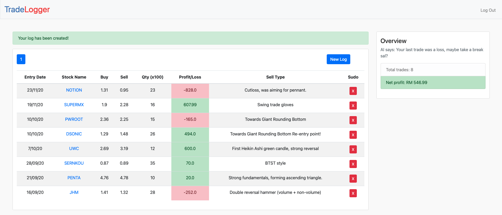

# tradelogger
TradeLogger, shiny ML-powered trade logging web app. 

### Tech powered by:
- Back-end: Flask
- Machine learning: scikit-learn, XGBoost

The app used **online machine learning** instead of batch offline ML, meaning that it learns from the user's recent trades in real-time and makes predictions from it constantly. The prediction gets better as the number of trades increases. It also has an AI feature which gives advice based on the user's recent trades.

